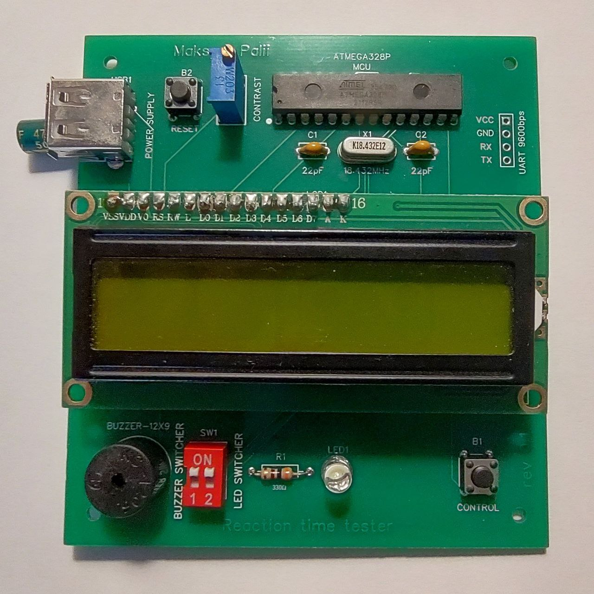
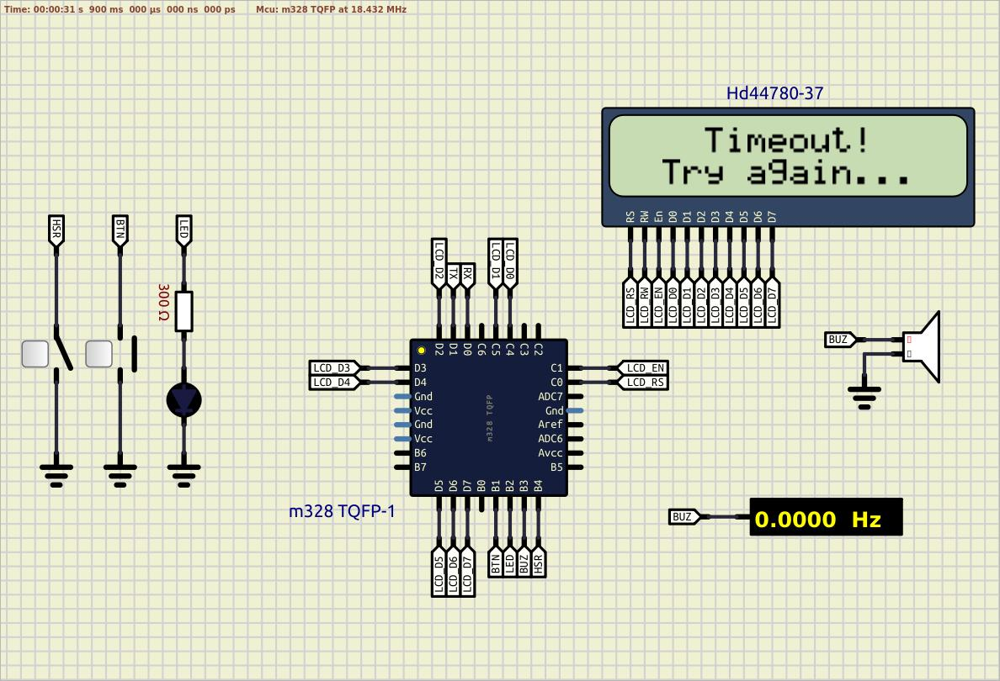

# Reaction Time Measurement System  

## Overview
This project implements a reaction time measurement system using an AVR microcontroller. The system measures the time taken for a user to react to a stimulus and displays the results on an LCD screen.  
In fact this is an assigment for laboratory work #1 from Cornell University ECE 4760 course - Spring 2012.  

## Features
- Measures user reaction time
- Displays results on an LCD screen
- Saves high scores to EEPROM
- Communicates with a PC over UART for monitoring

## Folder Structure
- **app**: Application-specific code
- **drivers**: Device driver implementations
- **finite_automaton**: State machine implementation
- **task_manager**: Task scheduling and handling

## How to Use
1. Connect the AVR microcontroller to the required peripherals.
2. Build and upload the code to the microcontroller.
3. Follow the hardware setup instructions in the documentation.
4. Monitor reaction time results using the LCD screen and UART communication.

## Dependencies
- AVR GCC Toolchain
- AVRDUDE for uploading firmware
- Terminal program for UART communication

## Attention  
Simulation only compatible with SimulIde 1.0.0!

Device top:  
  

Device bottom:  
  

Simulation:  
  

## TODO
- Introducing hardware and software parts  
- Rewrite Makefile in an Microchip studio manner
- Optimization buffers for lcd and UART messages

## License
This project is licensed under the [MIT License](LICENSE).